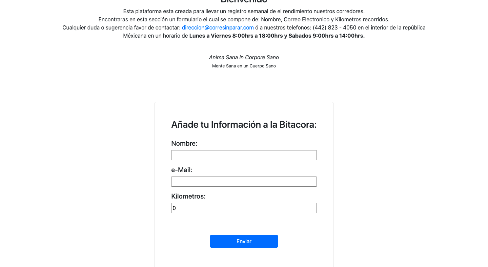
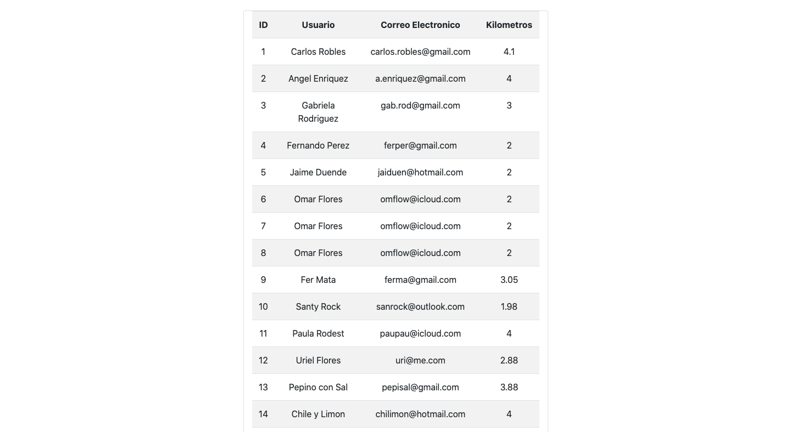
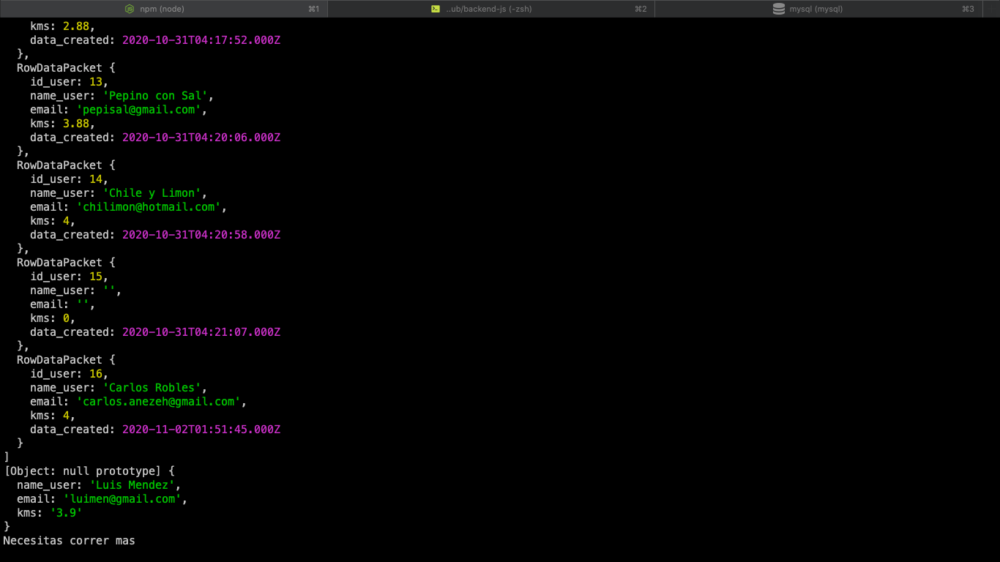

[](https://github.com/carlos-ssh/backend-js)
[](https://github.com/carlos-ssh/backend-js/issues)
[](https://github.com/carlos-ssh/backend-js/pulls)

# Generales
La idea principal de este proyecto es mostrar una tabla con contenido de un formulario almacenado en una base de datos y esta informacion mostrarla en una tabla con la informacion general, tales como: Nombre del usuario, email y kilometros recorridos. Asi mismo mostrar un mensaje en consola de aviso si el usuario necesita correr mas o si se a guardado su informacion correctamente.

## Se creó formulario para la captura de la información:


## Despliegue de la Información de la base de datos en la parte visual:


## Mensajes desplegados en la Consola en el Post:


#
## Como empezar:
 Para tener una copia del proyecto de manera local sigue los siguientes pasos desde tu terminal o cmd:


```
$ cd <folder>
```

```
$ git clone https://github.com/carlos-ssh/backend-js.git
```

#
## Desarrollado con:
- Ejs
- NodeJS
- JavaScript
- MySQL

  ... y mucho amor!!

#
# Author

👤 **Carlos Robles**

- Github: [@carlos.robles](https://github.com/carlos-ssh/)
- Twitter: [@carlos.robles](https://twitter.com/aom.robles)
- Linkedin: [carlos.robles](https://www.linkedin.com/in/carlos-ssh/)


#
## 🤝 Contributing

Contributions, issues and feature requests are welcome!
#